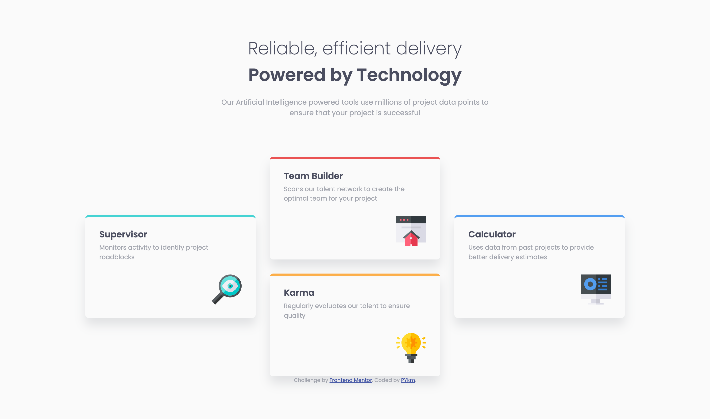

# Frontend Mentor - Four card feature section solution

This is a solution to the [Four card feature section challenge on Frontend Mentor](https://www.frontendmentor.io/challenges/four-card-feature-section-weK1eFYK). Frontend Mentor challenges help you improve your coding skills by building realistic projects.

## Table of contents

- [Overview](#overview)
  - [The challenge](#the-challenge)
  - [Screenshot](#screenshot)
  - [Links](#links)
- [My process](#my-process)
  - [Built with](#built-with)
  - [What I learned](#what-i-learned)
  - [Continued development](#continued-development)
  - [Useful resources](#useful-resources)
- [Author](#author)

## Overview

### The challenge

Users should be able to:

- View the optimal layout for the site depending on their device's screen size

### Screenshot




### Links

- Solution URL: [on Frontend Mentor](https://www.frontendmentor.io/solutions/four-card-feature-section-xT3SivNH9J)
- Live Site URL: [on Github](https://pykm.github.io/four-card-feature-section/)

## My process

### Built with

- Semantic HTML5 markup
- CSS custom properties
- Flexbox
- CSS Grid
- Mobile-first workflow

### What I learned

Use grid to style elements in rows and columns:

```css
.features {
  display: grid;
  grid-template-columns: repeat(3, 1fr);
}
```

Then place things on the grid use `grid-row`:

```css
.feature-supervisor,
.feature-calculator {
  grid-row: 1 / 3;
}

.feature-team-builder{
  grid-row: 1;
}

.feature-karma{
  grid-row: 2;
}
```

Use attribute selectors to select elements whose class starts with `feature-`:

```css
[class^='feature-'] {
  border-radius: 0.5em;
  box-shadow: 0 1em 1.5em 0 hsla(229, 6%, 66%, 0.3);
  display: flex;
  flex-direction: column;
  padding: 1.5em 2em;
  border-top: 0.3em solid;
}
```

### Continued development

Technique that I'm not completely comfortable with, can be found in this challenge:
- Use grid layout.
- Use `grid-row` and `grid-column` to place things on a grid.

Technique that I found useful, although not using in this challenge:
- SASS

### Useful resources

- [Grids on MDN](https://developer.mozilla.org/en-US/docs/Learn/CSS/CSS_layout/Grids) - This helped me to understand basic MDN. I found it useful.
- [How to select all classes containing a certain word on CSS-Tricks](https://css-tricks.com/forums/topic/select-all-classes-containing-a-word/#:~:text=You%20can%20use%20an%20attribute%20selector%20where%20the,all%20elements%20with%20a%20class%20beginning%20with%20icon) - This answer helped me to learn how to use attribute selector.

## Author

- Website - [PYkm](https://pykm.github.io/)
- Frontend Mentor - [@PYkm](https://www.frontendmentor.io/profile/PYkm)
